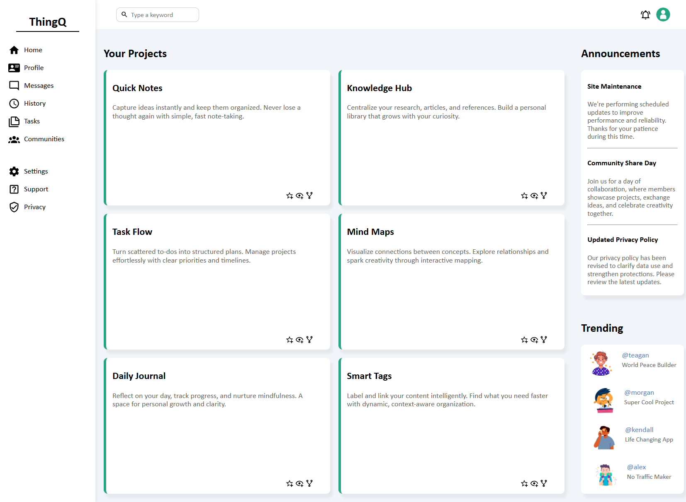

# Dashboard

A lightweight, responsive dashboard built entirely with vanilla HTML and CSS. This project demonstrates the power of CSS Grid and Flexbox, two modern layout tools that make structuring complex interfaces both efficient and adaptable.

- Pure HTML & CSS: No frameworks, libraries, or JavaScript required.

- Modern Layouts: Built exclusively with CSS Grid and Flexbox.

- Responsive Design: Adapts seamlessly to all screen sizes, from mobile to desktop.

- Lightweight & Efficient: Minimal codebase for fast loading and easy customization.

